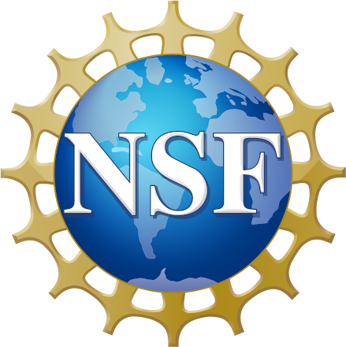
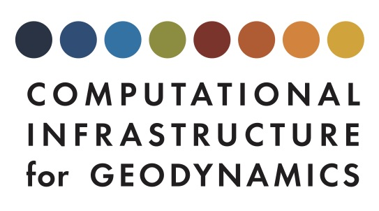
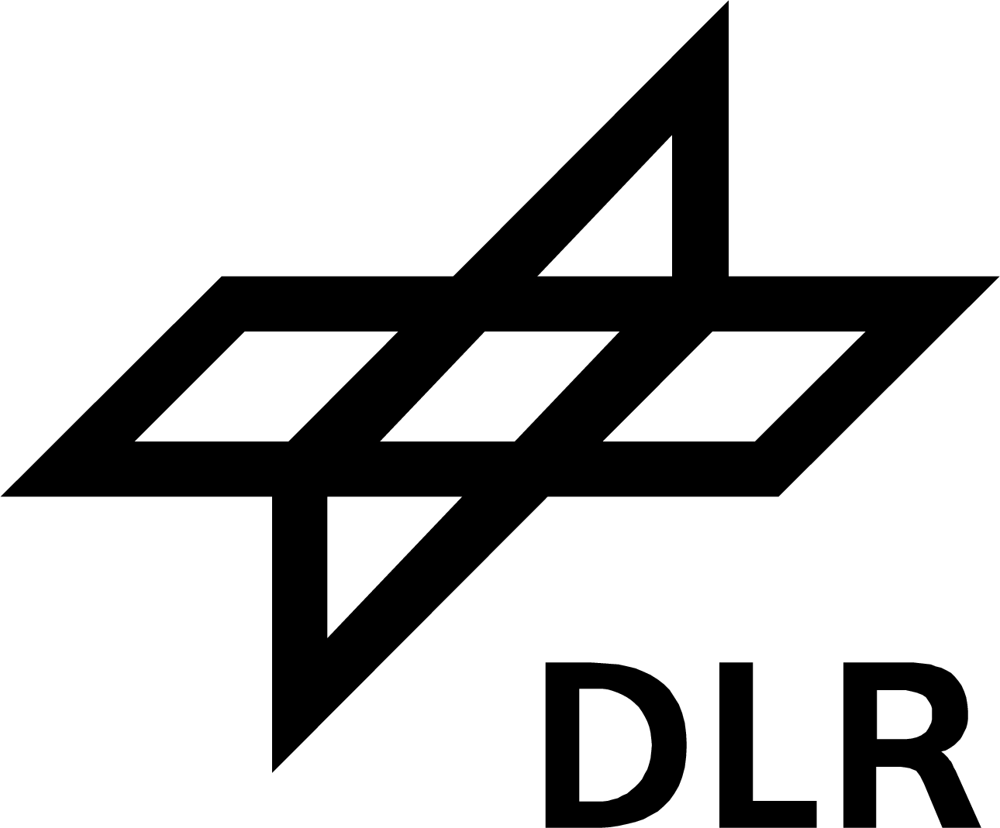
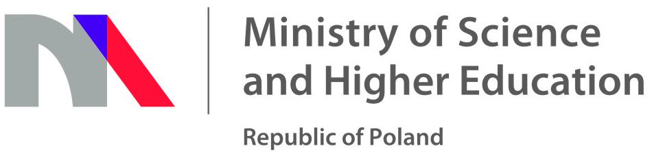
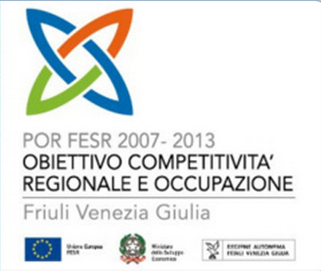

Funding
=======

 Like many other open source projects, a significant part of deal.II has been written either as a by-product for other projects people were funded for, or by people on university-funded positions. There are probably dozens if not hundreds of such projects that have led to some development of of deal.II. We are very grateful for this support!

Beyond this, deal.II has also been supported by some dedicated projects that have allowed us to work on extensions, documentation, training and dissemination that would otherwise not have been possible. In particular, we acknowledge the following sources of support with great gratitude:

- The Exa-DG project of the DFG priority program SPPEXA.

- National Science Foundation through award [OAC-1835673](https://www.nsf.gov/awardsearch/showAward?AWD_ID=1835673&HistoricalAwards=false) / [OAC-2015848](https://www.nsf.gov/awardsearch/showAward?AWD_ID=2015848&HistoricalAwards=false)

- National Science Foundation through award [OCI-1148116](https://www.nsf.gov/awardsearch/showAward?AWD_ID=1148116&HistoricalAwards=false).

- European Research Council (ERC) through the Advanced Grant 289049 MOCOPOLY.

- The [Computational Infrastructure in Geodynamics initiative (CIG)](https://geodynamics.org/), through the National Science Foundation under Awards No. EAR-0949446, EAR-1550901, and EAR-2149126 via The University of California - Davis.

- The Polish Ministry of Science and Higher Education has funded the development of eigenspectrum solvers under a grant "Finite element analysis of the quantum theory of finite electronic systems" (project number: N N519 402837).

- The development of the codimension one framework has been supported by "Regione Friuli Venezia Giulia - POR FESR 2007-2013 Obiettivo competitività regionale e occupazione", in the project "OpenSHIP: high quality computational fluid dynamics simulations to asses the hydrodynamic efficiency of the propeller-wake interaction using OpenSOURCE software".

- Some development has been funded through two IAMCS Innovation Awards, funded at the Institute of Applied Mathematics and Computational Sciences at Texas A&M University, via Award No. KUS-C1-016-04 made by King Abdullah University of Science and Technology (KAUST).

- The Helmholtz Association of German Research Centres and the DLR (German Aerospace Center) through the Helmholtz-Young-Investigators-Group 'New flow solver technology based on adaptive higher order Discontinuous Galerkin methods' under the support number VH-NG-215.

{ width="100" }
{ width="150" }
{ width="100" }
{ width="100" }
{ width="200" }
{ width="150" }
{ width="400" }
{ width="300" }
{ width="150" }
